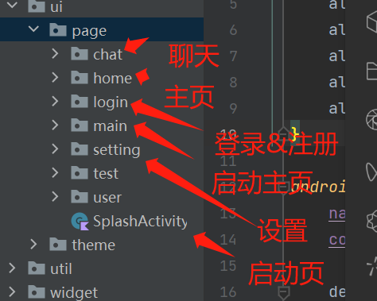

# AI招聘助手
----

开发环境：
- Tools : Android Studio giraffe
- os : windows 11
- code : kotlin

运行环境：

- os : Android 5.0 +

项目包含内容：

- Android project
- 安装包

第三方：

- 环信IM sdk
- minmax AI接口

## 项目背景
- 企业方面：
为企业提供高效、精准的招聘解决方案。
首先，我会根据企业的需求，分析并制定合适的招聘策略，包括职位描述、薪资范围、招聘渠道等。其次，利用先进的AI技术进行简历筛选，帮助企业快速找到符合要求的候选人。
最后，我还提供员工入职培训、绩效评估等服务，帮助企业优化人力资源管理。
- 个人方面：
该项目可以帮助个人修改简历，填充简历，丰富你的简历。

## 运行说明
本项目登录功能全部采用环信sdk提供的登录功能呢。
由于本项目没有后台，很多功能和数据都是在本地做的处理

安装包：[安装包](安装包/app-release.apk)

# 启动页面

# 登录页面

登陆页面包含注册和登录，全部采用环信im服务

# 聊天列表界面

目前只有一个招聘ai来聊天

# 聊天页面

AI招聘助手将会按照需要进行回复

# 退出界面

# 代码展示

本项目采用 Android原生 kotlin
页面代码采用 compose来进行开发
架构采用 mvvm

# 基础框架

# 应用基础结构

# 页面结构

