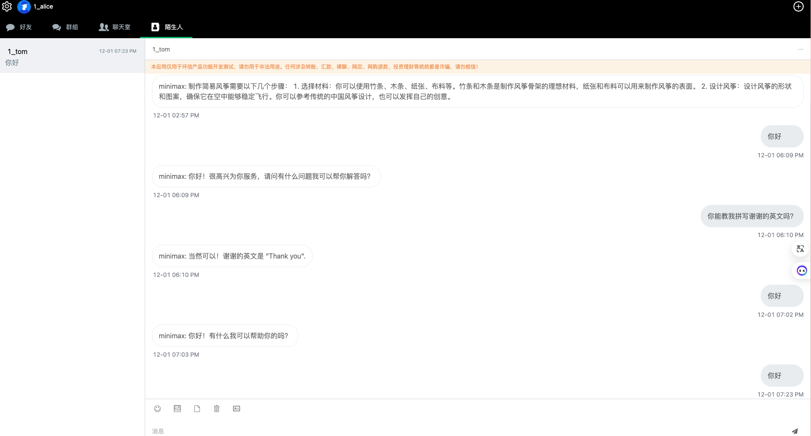
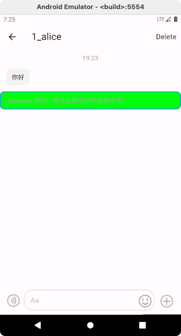
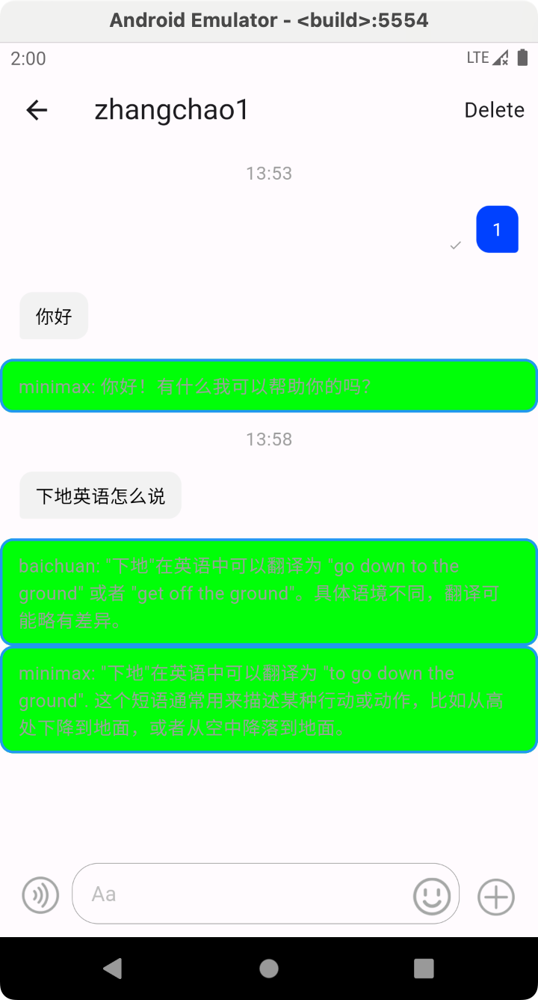
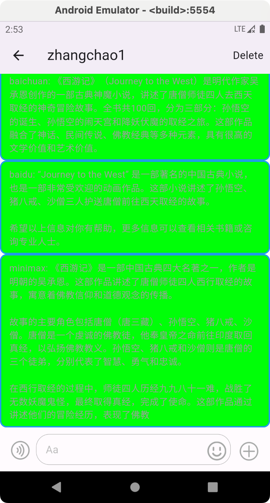
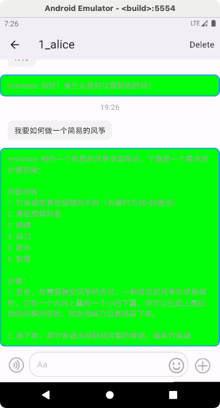
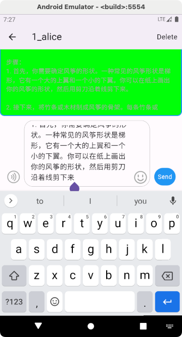

# AI专家助手
----

开发环境：
- Tools : VS Code
- os : MacOS
- code : dart

运行环境：

- os : Android 7.1 +

项目包含内容：

- Flutter Project
- 安装包

第三方：

- 环信IM sdk
  - 单聊消息
  - 消息扩展
  - 发送前回调
- minmax AI接口

## 项目背景

探索环信IM服务如何和AI相关的服务进行密切的配合，以达到提升专业人士的效能最大化。
现存市面上大部分的AI主要是面向个人的，而当前的AI助手并不能准确无误的解决大部分人的问题，尤其在一些特定的
领域，比如 编程，医疗等主页技能要求较高的方向，虽然的AI能够给出相应的回复，但是这些回复对于普通人来说，
甄别其中的准确性依然存在一定的问题。该项目通过一般咨询者的信息，收集不同AI厂商的建议或者帮助信息，能够
大大的提升相应的工作效率。进而实现专家的效率，而当前社会专家才是更大的瓶颈。

## 功能列表

- 给出适当的建议，能够根据给出的提示辅助专家

## 运行说明

进入项目的expert目录，执行以下命令可以进行直接安装

```
cd expert
flutter run 
```
## 安装包

[android安装包](install/app-release.apk)

## 效果展示

1. 咨询方
咨询方的使用上和普通的用户完全一样，不需要特殊的处理


2. 专家方

普通的简单业务咨询



多个AI渠道给出专家建议





复杂的业务场景



专家根据各方的提示，整合自己的理解和经验给出更加合理回答



- 发送者的消息建议


## 设计实现

1. 整体的实现策略，如果AI的处理能够在3s内完成，比如 你好，这种简单的问句，则直接采用同步的方式，将建议的信息带到消息的内容中
2. 如果是超过3s，即给提示将超过一定的时间，使用下面的步骤进行操作
- 消息拦截，但是不返回错误，这样保证发起方能正常展示该消息
- 消息接收方不能第一时间接收到消息
- 待对应的AI建议到达后，发送消息给接收方并且附带上相应的AI建议