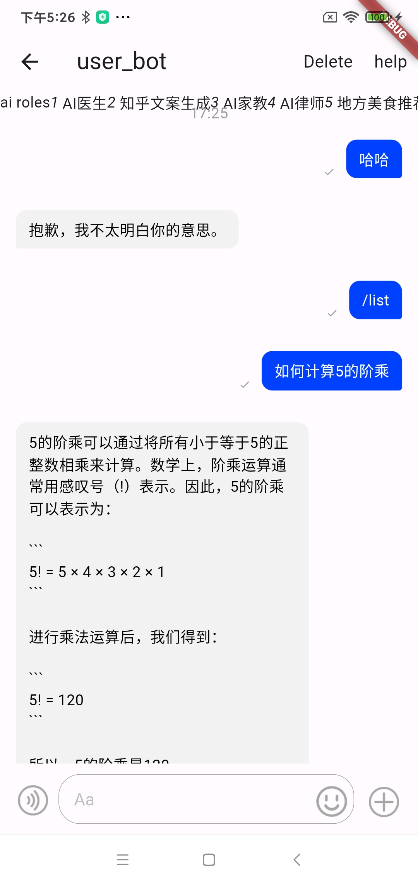
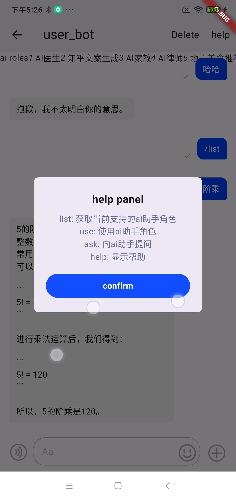

# ai群聊管家

本项目提供群聊，单聊机器人服务

目前实现的功能有(功能录屏见doc目录)

1. 群聊历史消息总结

2. 单聊ai-bot聊天

web:

app:

3. app登录逻辑

通过命令方式激活机器人，可以很好的后续扩展功能

[项目接口文档](https://www.yuque.com/yuqueyonghueaibvg/gabk83/kfxek80t771o139a)
