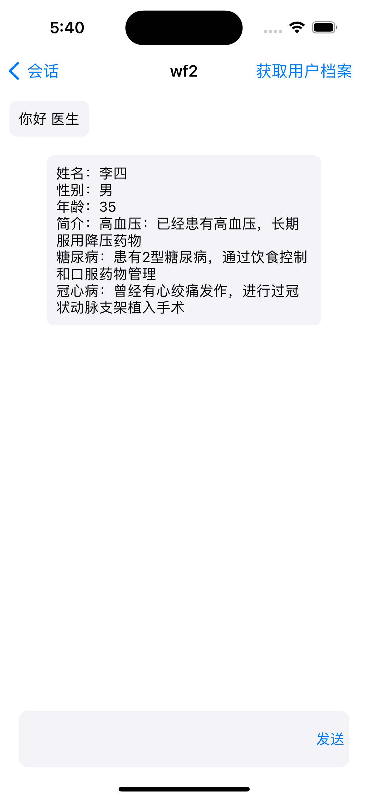

# 智慧医疗

开发环境
项目包含iOS端和服务器端
- ChatAi：iOS端 用的是swift语音编写
- ChatAi_go：服务器端，用go语言编写
- 服务器配置：2核4g

第三方：
- 环信IM sdk
- 同义千问 接口

功能说明：
- 注册页面，需要填写用户的相关信息

- 登录页面（用户登录）

- 登录成功，可以从后台获取所有医生数据（医生分为ai医生和真实的医生）

- 后台的医生数据和刚注册的用户数据

- 登录页面（医生登录）

- 用户和ai医生进行聊天

- 1：用户和ai医生聊天完成 点击右上角的生成记录 大模型可以根据聊天记录生成一个重点总结
- 2：根据聊天数据和数据库中的医生数据推荐一名医生（解决用户不知道挂哪一科的问题）

- 用户用户个人中心页面

- 点击查询记录，会进入咨询记录页面（记录用户每一次沟通的重要总结）

- 点击医生，会介绍医生的数据

- 和真实医生聊天，医生可以点击获取用户档案，用户可以收到医生的请求，并决定是否给当前医生自己的信息（位置已修改）

- 当用户允许医生获取自己的用户信息，医生界面会出现用户的信息

- 和真实医生聊天，医生可以点击获取用户咨询记录，用户可以收到医生的请求，并决定提供那一条记录，也可以点击备件不提供

- 模拟一次用户和医生的对话，并生成记录（和真实医生沟通，只生成记录，不在推荐医生了）

- 第一条数据就是和医生5沟通之后的记录生成

- 数据中保存了刚刚wf2这个用户的记录

